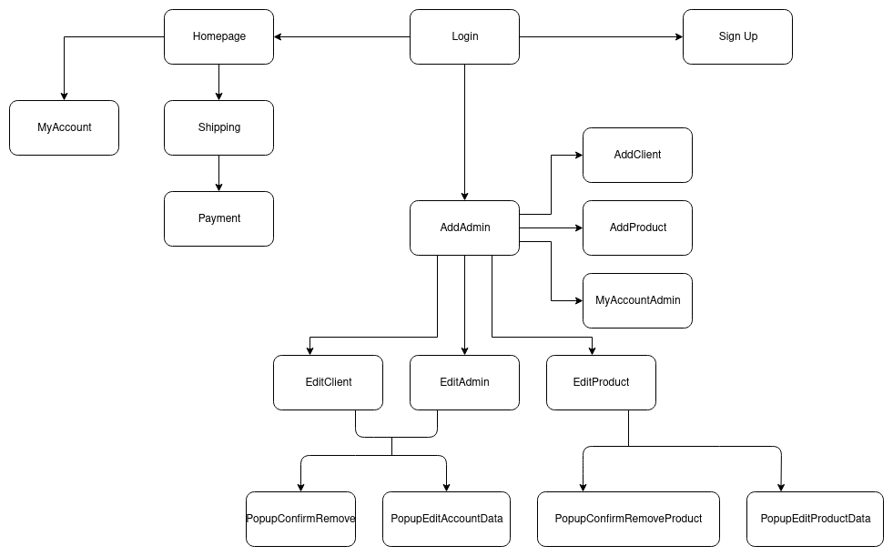

# Web-Project
This is the final project of the Introduction to Web Development course taught in the first semester of 2022.

This consists of a virtual sports shop, where users can buy things to practice their favorite sport and administrators can manage their products and users.

## Group
* Pedro Henrique Conrado - 11819091
* Victor Paulo Cruz Lutes - 11795512
* Gabriel Vicente Rodrigues - 11795377


# 1. Requirements

### The system must have 2 types of users: Clients and Administrators

Administrators are responsible for registering/managing administrators, customers, and products/services provided. The application already comes with an account admin with password admin.

Customers are users who access the system to buy products/services.

The admin record includes, at least: name, id, phone, email.

Each customer's record includes, at least: name, id, address, phone, email

Product/services records include, at least: name, id, photo, description, price, quantity (in stock), quantity sold.
Your store may sell products, services or both (you decide)

### Selling Products (or services): 

Products are selected, their quantity chosen, and are included in a cart. Products are purchased using a credit card number (any number is accepted by the system). The quantity of product sold is subtracted from the quantity in stock and added to the quantity sold. Carts are emptied only on payment or by customers.

### Product/Service Management: 
Administrators can create/update/read/delete (crud) new products and services. For example, they can change the stock quantity.

### Your functionality: 
Our current idea is for the user to be able to see a 3d model of the product you want to buy when the user clicks on the image of the product.

### The system must provide accessibility requirements and provide good usability. The system must be responsive.


# 2. Project Description
Our project is a sports products store. It allows admins and clients to login and clients to create their own account.

The clients are presented to the products of the store and are allowed to add them to their cart, change their personal data and buy the products on the cart.

The admins are allowed to change their personal data, register new admins and clients and manage the products of the store.

### Navigation Diagram


The images of the mockup are in the directory ```/mockups```

* [Login](mockups/Login.png)
    * [Sign Up](mockups/Sign%20Up.png)
    * [Homepage](mockups/Homepage.png)
        * [My Account](mockups/MyAccountClient.png)
        * [Shipping](mockups/Shipping.jpg)
            * [Payment](mockups/payment.jpg)
    * [Add Admin](mockups/AddAdmin.png)
        * [Add Client](mockups/AddClient.png)
        * [Edit Client](mockups/EditClient.png)
        * [Add Product](mockups/AddProduct.png)
        * [Edit Product](mockups/EditProducts.png)
        * [Edit Admin](mockups/EditAdmin.png)
        * [My Account Admin](mockups/MyAccountAdmin.png)

You can also see our [Figma](https://www.figma.com/file/ijJYtFiTaDnPejZwvTwijs/Mockups), where we designed these screens.

### Funcionalities
* The user can log in using his email and password
* A new client can create his account
* The user can view and modify his personal data
* The admin can register, view, update and delete users and products
* The client can view the products available in the store
* The client can view information about a specific product
* The client can add a quantity of a product to his personal cart
* The client can buy the products present in his cart with a credit card
* The client can view a 3D model, if available, of a product

### Server
Info saved on the server:

#### Accounts
* Id (PK)
* Name
* Email (Unique)
* Password
* Phone
* Address
* ProfilePicture
* IsAdmin

#### Products
* Id (PK)
* Name
* Description
* Price
* QuantityStock
* QuantitySold
* Image
* Image3d

# 3. Comments About the Code

# 4. Test Plan

# 5. Test Results

# 6. Build Procedures

# 7. Problems

# 8. Comments
